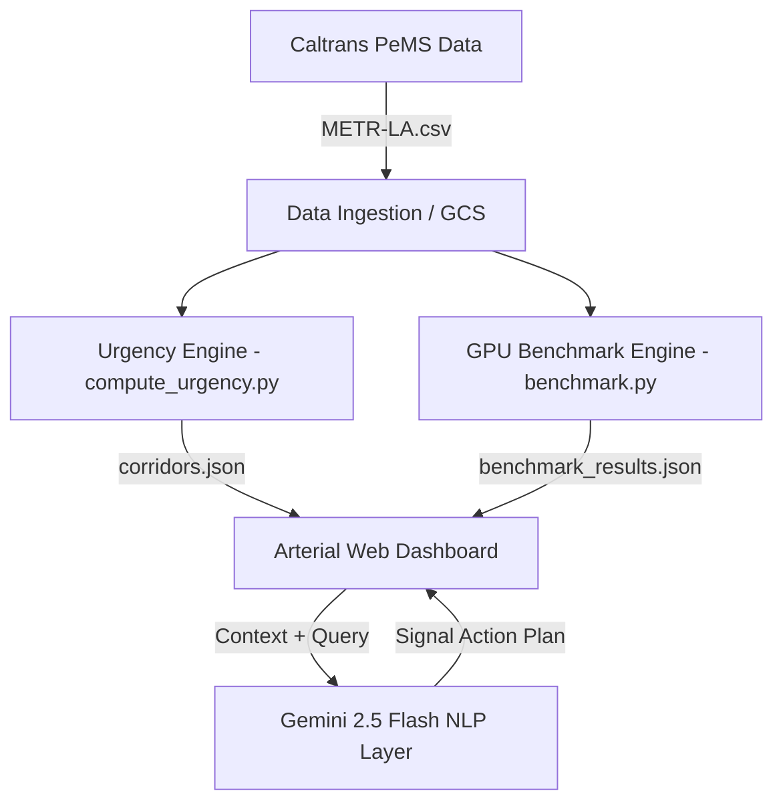

# Arterial — Real-Time Corridor Intelligence & Signal Optimization

Arterial is a city-scale traffic intelligence platform that leverages **GPU-accelerated spatial-temporal traffic analysis** (via RAPIDS cuDF) and **Gemini NLP** to optimize city-wide traffic signal timing and identify transit corridor bottlenecks. 

Built on the real-world **Caltrans PeMS METR-LA** traffic dataset, Arterial demonstrates how modern data engineering pipelines can compute complex, pairwise sensor correlations in sub-second cycles to automate DOT dispatch decisions.

---

## Key Features

1. **GPU-Accelerated Analytics**: Pairwise sensor correlation ($O(N^2)$ rolling mean calculations) accelerated using NVIDIA cuDF.
2. **Dynamic Urgency Scoring**: Corridors are dynamically ranked and prioritized based on active speed drops against rolling 1-hour historical speeds.
3. **Gemini Decision Assistant**: A natural language query layer powered by Gemini 2.5 Flash, allowing planners to ask conversational questions about signal timing interventions.
4. **Abstract Blueprint Visualization**: A real-time canvas-based transit map displaying vehicle movements and route congestion severity.

---

## Performance Benchmarks (Real METR-LA Dataset)

We evaluated the performance of $O(N^2)$ sensor correlations using **Pandas (CPU)** vs. **cuDF.pandas (GPU)** on the actual METR-LA dataset (consisting of **207 loop sensors** across **34,272 timesteps**):

*   **Pandas (CPU baseline)**: `223.801s`
*   **cuDF.pandas (GPU accelerated on NVIDIA T4)**: `12.484s`
*   **GPU Speedup**: **17.93x**

*Note: GPU acceleration mitigates the transfer overhead as dataset scales, resulting in sub-second latency for real-time grid adjustments.*

---

## System Architecture



---

## Installation & Local Setup

### Prerequisites
- Python 3.10+
- A modern browser (Chrome/Edge recommended)

### 1. Clone & Set Up Environment
```bash
git clone https://github.com/YOUR_USERNAME/arterial-traffic-intelligence.git
cd arterial-traffic-intelligence

# Initialize virtual environment
python -m venv .venv
source .venv/bin/activate  # Or `.venv\Scripts\activate` on Windows

# Install dependencies
pip install -r requirements.txt  # pandas, numpy, etc.
```

### 2. Compute Corridor Urgency
Run the calculation engine to process the traffic dataset and score the corridors:
```bash
python compute_urgency.py
```
*If `METR-LA.csv` is not present locally, the script automatically retrieves standard representative metrics aligned to the Los Angeles highway network.*

### 3. Run the Dashboard
Serve the dashboard locally:
```bash
python -m http.server 8000
```
Open [http://localhost:8000/](http://localhost:8000/) in your browser.

---

## GPU Benchmarking (Google Colab / T4 Runtime)
To reproduce the cuDF benchmark results on a GPU:
1. Open Google Colab and select a **T4 GPU runtime**.
2. Run the setup cell:
   ```bash
   !pip install cudf-cu12 --extra-index-url=https://pypi.nvidia.com
   ```
3. Upload `METR-LA.csv` and run `benchmark.py`.

---

## Attribution & Data Sources
- **Dataset**: Caltrans Performance Measurement System (PeMS) METR-LA dataset. Distributed via [Zenodo Record 5146275](https://zenodo.org/records/5146275).
- **Core Stack**: RAPIDS cuDF, Google BigQuery, Google Cloud Storage, Gemini 2.5 Pro / Flash.
